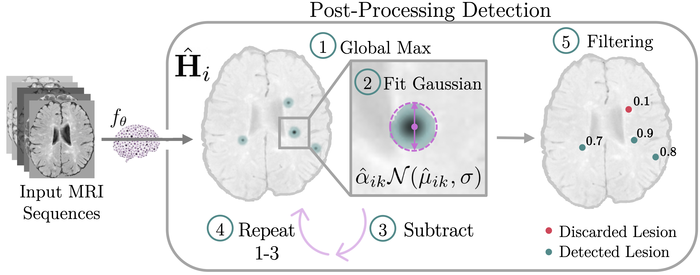

# Heatmap Regression for Lesion Detection using Pointwise Annotations
**Accepted at Medical Image Learning with Limited & Noisy Data (MILLanD) hosted by MICCAI 2022**

<div style="text-align: justify">
	In many clinical contexts, detecting all lesions is imperative for evaluating disease burden and treatment efficacy. However, standard approaches pose lesion detection as a segmentation problem despite the time-consuming nature of acquiring segmentation labels. In this paper, we present a lesion detection method using only point annotations and train a model via Gaussian heatmap matching. Our proposed refinement method of iteratively fitting Gaussian distributions offers a reliable way of directly estimating the lesion existence uncertainty. Experimental results on Gad lesion detection show our method performs competitively compared to training with full segmentation labels. Finally, our detection models provide a suitable pre-training for segmentation. When fine-tuning on only 17 (1\%) segmentation samples, our models achieve comparable performance to training with the full dataset.
</div>




### Experiments
For reproducibility purposes, the full code for the experiment section is located in the ```code``` folder (released in agreement with the pipeline creators). See the README in ```code/pvg-pipeline/``` for a detailed description of usage.
